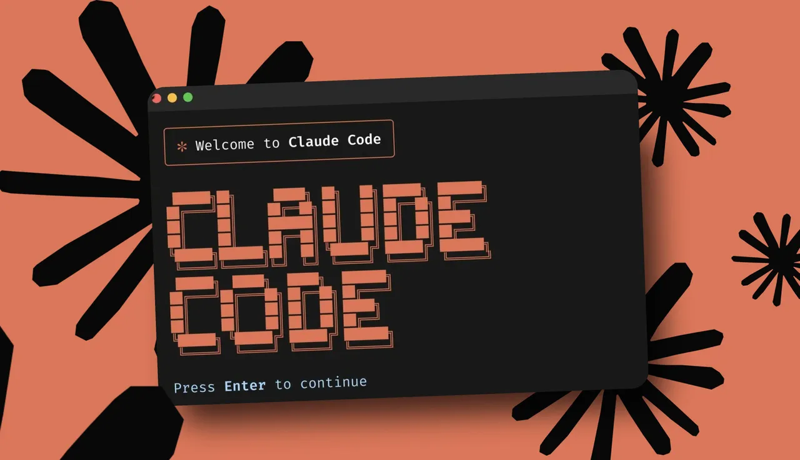
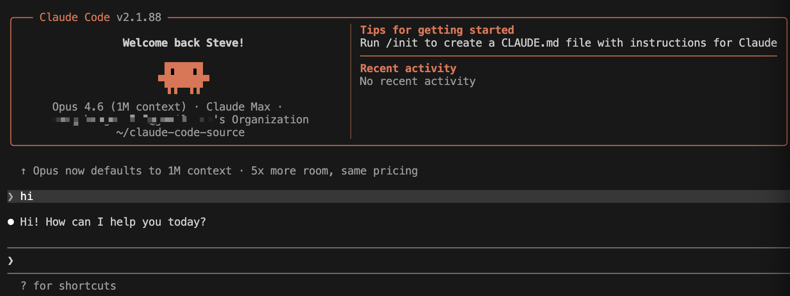

<p align="center">
  
</p>

<h1 align="center">Claude Code Source — Architecture Study & Learning Material</h1>

<p align="center">
  <strong>Production-grade AI Agent internals, dissected for learning.</strong>
</p>

<p align="center">
  <a href="https://github.com/anthropics/claude-code"></a>
  <a href="#license"></a>
  <a href="#deep-analysis-series"></a>
  <a href="#run-from-source"></a>
</p>

<p align="center"><b><a href="README.zh.md">中文版</a></b></p>

---

This repository contains the **extracted source code** of [Claude Code](https://claude.ai/code) (Anthropic's AI programming CLI) along with **18 original deep-analysis articles** (bilingual: English & Chinese) dissecting its architecture. The source was discovered from publicly available repositories and is provided **strictly for educational and research purposes**.

All intellectual property rights of the source code belong exclusively to **Anthropic, PBC**.

---

[Disclaimer](#disclaimer) · [Why Study This](#why-study-this-codebase) · [Architecture](#architecture-at-a-glance) · [Deep Analysis](#deep-analysis-series) · [Run from Source](#run-from-source) · [Tech Stack](#technology-stack) · [Structure](#project-structure) · [License](#license)

---

## Disclaimer

> **IMPORTANT: READ BEFORE USE**

**This repository is strictly for educational and research purposes only.**

- **Source**: The source code was discovered from publicly available sources, including [instructkr/claw-code](https://github.com/instructkr/claw-code). The run-from-source setup is based on [JiaranI/start-claude-code](https://github.com/JiaranI/start-claude-code). It contains extracted source code of [Claude Code](https://claude.ai/code), a product by [Anthropic](https://anthropic.com).
- **Ownership**: All intellectual property rights belong exclusively to **Anthropic, PBC**. This repository claims no ownership, authorship, or rights over the original code.
- **Purpose**: Provided **solely** as learning material for understanding AI agent system architecture and engineering patterns — for academic study, technical research, and educational discussion.
- **Prohibited uses**:
  - Commercial purposes of any kind
  - Building competing products or services
  - Redistribution or repackaging of the source code
  - Any purpose that violates Anthropic's [Terms of Service](https://www.anthropic.com/terms) or applicable laws
- **Analysis articles**: The deep analysis articles (`claude-code-deep-analysis/`) are **original commentary and analysis** by the repository maintainers. Code snippets are included for commentary, criticism, and education purposes. These articles do not constitute legal advice.
- **DMCA / Takedown**: If you represent Anthropic or believe this repository infringes on intellectual property rights, please contact us — we will **promptly remove** the infringing content. You may also file a DMCA takedown notice through [GitHub's DMCA process](https://docs.github.com/en/site-policy/content-removal-policies/dmca-takedown-policy).
- **No warranty**: Provided "as is" without warranty of any kind.

---

## Why study this codebase?

Claude Code is one of the most sophisticated production AI agent systems publicly observable. Unlike toy frameworks and demo agents, it is engineered for **real-world, hours-long coding sessions** with enterprise-grade reliability. Studying it reveals hard-won engineering decisions that no tutorial covers:

| Design Decision | Insight |
|:---|:---|
| **Loop over Graph** | A `while(true)` loop replaces DAG-based workflow orchestration — simpler, more flexible, easier to reason about at runtime |
| **Recursion over Orchestration** | Sub-agents recursively call `query()`, inheriting compression, error recovery, and streaming for free |
| **Model decides, Framework executes** | The framework enforces safety constraints (concurrency, side effects, permissions); all reasoning stays in the model |
| **Built for 4-hour sessions** | Four-layer context compression and three-level 413 error recovery — invisible in demos, critical in production |
| **Immutability as cost optimization** | Immutable API messages maximize prompt caching hits, reducing long-session costs by ~80% |

---

## Architecture at a glance

```
                        CLI / VS Code / IDE Extension
                                    │
                                    ▼
                        ┌───────────────────────┐
                        │   EntryPoint (cli.tsx)  │
                        │   Fast-path routing     │
                        └───────────┬───────────┘
                                    │
                        ┌───────────▼───────────┐
                        │     QueryEngine         │
                        │   Session management    │
                        │   API client wrapper    │
                        └───────────┬───────────┘
                                    │
                ┌───────────────────▼───────────────────┐
                │          query() — Core Agent Loop     │
                │   ┌─────────────────────────────────┐  │
                │   │  while (true) {                 │  │
                │   │    messages = buildPrompt()      │  │
                │   │    response = stream(messages)   │  │
                │   │    tools = extractToolCalls()    │  │
                │   │    if (!tools) break             │  │
                │   │    results = executePar(tools)   │  │
                │   │    messages.push(results)        │  │
                │   │    maybeCompress(messages)       │  │
                │   │  }                              │  │
                │   └─────────────────────────────────┘  │
                └──────┬──────────┬──────────┬──────────┘
                       │          │          │
              ┌────────▼──┐ ┌────▼────┐ ┌───▼────────┐
              │ 45+ Tools  │ │ Permis- │ │ Context    │
              │ Bash, Edit │ │ sion    │ │ Compression│
              │ Glob, Grep │ │ System  │ │ 4 layers   │
              │ MCP, LSP…  │ │ 5 modes │ │ + 413 heal │
              └────────────┘ └─────────┘ └────────────┘
```

### By the numbers

| Metric | Count |
|:---|:---|
| Core agent loop (`query.ts`) | 1,729 lines |
| Main UI component (`main.tsx`) | 4,683 lines |
| Tool implementations | 45+ |
| Slash commands | 87+ |
| React UI components | 146+ |
| Utility functions | 564+ |
| React hooks | 85+ |
| Service modules | 38 |
| Feature flags | 89 |
| System prompt assembly (`prompts.ts`) | 54.3 KB |

---

## Deep Analysis Series

We produced **18 original articles** with source-level deep dives into every major subsystem. Each article is available in both **English** and **Chinese**.

**[Enter the analysis series (EN) →](claude-code-deep-analysis/README.en.md)** ｜ **[进入分析系列 (中文) →](claude-code-deep-analysis/README.md)**

### Part 1: Core Agent Engine

| # | Topic | English | 中文 |
|:--|:------|:--------|:-----|
| 00 | Core Conclusions | [EN](claude-code-deep-analysis/00-core-conclusion.en.md) | [中文](claude-code-deep-analysis/00-core-conclusion.md) |
| 01 | Entry Point | [EN](claude-code-deep-analysis/01-entry-point.en.md) | [中文](claude-code-deep-analysis/01-entry-point.md) |
| 02 | Main Loop | [EN](claude-code-deep-analysis/02-main-loop.en.md) | [中文](claude-code-deep-analysis/02-main-loop.md) |
| 03 | Streaming | [EN](claude-code-deep-analysis/03-streaming.en.md) | [中文](claude-code-deep-analysis/03-streaming.md) |
| 04 | Tool Orchestration | [EN](claude-code-deep-analysis/04-tool-orchestration.en.md) | [中文](claude-code-deep-analysis/04-tool-orchestration.md) |
| 05 | Permission System | [EN](claude-code-deep-analysis/05-permission-system.en.md) | [中文](claude-code-deep-analysis/05-permission-system.md) |
| 06 | Sub-Agents | [EN](claude-code-deep-analysis/06-sub-agent.en.md) | [中文](claude-code-deep-analysis/06-sub-agent.md) |
| 07 | Context Window | [EN](claude-code-deep-analysis/07-context-window.en.md) | [中文](claude-code-deep-analysis/07-context-window.md) |
| 08 | Message Types | [EN](claude-code-deep-analysis/08-message-types.en.md) | [中文](claude-code-deep-analysis/08-message-types.md) |
| 09 | Immutable Messages | [EN](claude-code-deep-analysis/09-immutable-api-messages.en.md) | [中文](claude-code-deep-analysis/09-immutable-api-messages.md) |
| 10 | Architecture Diagram | [EN](claude-code-deep-analysis/10-architecture-diagram.en.md) | [中文](claude-code-deep-analysis/10-architecture-diagram.md) |
| 11 | Design Philosophy | [EN](claude-code-deep-analysis/11-design-philosophy.en.md) | [中文](claude-code-deep-analysis/11-design-philosophy.md) |

### Part 2: Peripheral Subsystems

| # | Topic | English | 中文 |
|:--|:------|:--------|:-----|
| 12 | MCP Integration | [EN](claude-code-deep-analysis/12-mcp-integration.en.md) | [中文](claude-code-deep-analysis/12-mcp-integration.md) |
| 13 | Memory System | [EN](claude-code-deep-analysis/13-memory-system.en.md) | [中文](claude-code-deep-analysis/13-memory-system.md) |
| 14 | System Prompt | [EN](claude-code-deep-analysis/14-system-prompt.en.md) | [中文](claude-code-deep-analysis/14-system-prompt.md) |
| 15 | Session & Bridge | [EN](claude-code-deep-analysis/15-session-resume.en.md) | [中文](claude-code-deep-analysis/15-session-resume.md) |
| 16 | Tool Implementations | [EN](claude-code-deep-analysis/16-tool-implementations.en.md) | [中文](claude-code-deep-analysis/16-tool-implementations.md) |
| 17 | Hook System | [EN](claude-code-deep-analysis/17-hook-system.en.md) | [中文](claude-code-deep-analysis/17-hook-system.md) |

---

## Run from Source

This repository supports running Claude Code locally from source (with reduced functionality). Verified working with version `2.1.88`.

### Prerequisites

| Dependency | Notes |
|:---|:---|
| **Node.js** >= 18 | For the setup script |
| **Bun** >= 1.0 | Runtime for Claude Code (auto-installed by setup) |
| **Authentication** | Claude Pro/Max/Team subscription (OAuth) **or** API key (`sk-ant-xxx`) |

### Quick start

```bash
# 1. Install dependencies and generate shims
node scripts/setup.mjs

# 2. Login with your Claude subscription (opens browser)
./start.sh login

# 3. Launch
./start.sh
```

<p align="center">
  
  <br>
  <em>Running from source with Claude Pro/Max subscription — Opus 4.6 (1M context) ✓</em>
</p>

<details>
<summary><strong>Alternative: Use an API key instead</strong></summary>

```bash
export ANTHROPIC_API_KEY="sk-ant-xxx"
./start.sh
```

</details>

<details>
<summary><strong>Windows users</strong></summary>

```cmd
rem Use API key on Windows (OAuth login requires start.sh on macOS/Linux)
set ANTHROPIC_API_KEY=sk-ant-xxx
bun src/entrypoints/cli.tsx
```

- **ripgrep**: The `tar` extraction in the setup script may fail on Windows. Install [ripgrep](https://github.com/BurntSushi/ripgrep/releases) manually and ensure `rg` is on your PATH.
- **Bun path**: After installing Bun, restart your terminal or add `%USERPROFILE%\.bun\bin` to PATH.
- **OAuth login**: `start.sh login` is macOS/Linux only. On Windows, run `bun src/entrypoints/cli.tsx auth login --claudeai`.

</details>

### Shim files created

These files are **not** part of the original source — they were created to make the source runnable:

| File | Purpose |
|:---|:---|
| `package.json` | 100+ dependencies reverse-engineered from import statements |
| `tsconfig.json` | TypeScript config with `baseUrl` and `.js → .ts/.tsx` path resolution |
| `bunfig.toml` | Bun config specifying the preload plugin |
| `preload.ts` | Core shim: `bun:bundle` mock (`feature()` returns `false`), `MACRO.*` global injection |
| `scripts/setup.mjs` | One-command setup: dependency install, private package stubs, missing file generation, ripgrep download |
| `start.sh` | macOS/Linux launcher with OAuth login (`./start.sh login`), credential detection (Keychain/file/env), proxy auto-detection |

### How it works

| Challenge | Solution |
|:---|:---|
| `bun:bundle` compile-time API | `preload.ts` provides a runtime shim; `feature()` returns `false` for all flags |
| 89 feature flags | All disabled — feature-gated code paths do not execute |
| `MACRO.*` compile-time macros | Defined as `globalThis.MACRO` in `preload.ts` |
| `from 'src/...'` imports | Source under `src/`; `tsconfig.json` `baseUrl: "."` for natural resolution |
| No `package.json` | Reverse-engineered 100+ dependencies from import statements |
| `@ant/*` private packages | `scripts/setup.mjs` creates empty stubs |

### Unavailable features (missing private packages)

| Feature | Missing Package | Description |
|:---|:---|:---|
| Computer Use | `@ant/computer-use-mcp` | Screenshots, mouse clicks, keyboard input |
| Native input | `@ant/computer-use-input` | Rust/enigo native bindings |
| macOS screen/window | `@ant/computer-use-swift` | Swift native bindings (macOS only) |
| Chrome integration | `@ant/claude-for-chrome-mcp` | Chrome extension MCP server |
| Sandbox runtime | `@anthropic-ai/sandbox-runtime` | Command execution sandbox |
| MCP Bridge | `@anthropic-ai/mcpb` | MCP protocol bridge |

<details>
<summary><strong>All 89 feature flags (all disabled)</strong></summary>

Since `feature()` returns `false` at runtime, all feature-gated code paths are inactive:

`ABLATION_BASELINE` `AGENT_MEMORY_SNAPSHOT` `AGENT_TRIGGERS` `BRIDGE_MODE` `BUDDY` `BUILDING_CLAUDE_APPS` `CCR_AUTO_CONNECT` `COORDINATOR_MODE` `DAEMON` `DIRECT_CONNECT` `DUMP_SYSTEM_PROMPT` `FORK_SUBAGENT` `HISTORY_PICKER` `KAIROS` `MCP_SKILLS` `MONITOR_TOOL` `NATIVE_CLIPBOARD_IMAGE` `PERFETTO_TRACING` `QUICK_SEARCH` `SSH_REMOTE` `STREAMLINED_OUTPUT` `TEAMMEM` `TEMPLATES` `TERMINAL_PANEL` `TORCH` `ULTRAPLAN` `ULTRATHINK` `VOICE_MODE` `WEB_BROWSER_TOOL` `WORKFLOW_SCRIPTS` and 59 more.

</details>

### Inferred build pipeline

```
TypeScript source
  │
  ├─ Bun bundler (bun build)
  │   ├─ Inject MACRO.* constants (--define)
  │   ├─ Resolve feature() calls → set 89 feature flags true/false
  │   ├─ Dead Code Elimination → strip disabled feature branches
  │   └─ Bundle into single JS file
  │
  ├─ Optional: Bun compile → single-file executable binary
  │
  └─ Publish to npm (@anthropic-ai/claude-code)
```

### Troubleshooting

| Error | Fix |
|:---|:---|
| `Cannot find module 'src/...'` | Verify source is under `src/` and `bunfig.toml` exists |
| `Missing 'default' export in module '*.md'` | Run `node scripts/setup.mjs` to regenerate stubs |
| `Cannot find package '@ant/...'` | Run `node scripts/setup.mjs` to recreate stubs |
| `bun: command not found` | Install Bun: `curl -fsSL https://bun.sh/install \| bash` |
| `No authentication found` | Run `./start.sh login` for OAuth, or `export ANTHROPIC_API_KEY="sk-ant-xxx"` for API key |
| Using a non-Anthropic proxy | `start.sh` auto-detects; manual: set `DISABLE_PROMPT_CACHING=1` and `DISABLE_INTERLEAVED_THINKING=1` |

### Want the official release?

```bash
npm install -g @anthropic-ai/claude-code
```

---

## Technology stack

| Layer | Technologies |
|:---|:---|
| **Runtime** | Node.js >= 18, Bun >= 1.0 |
| **Language** | TypeScript with React JSX |
| **UI** | React 19, custom terminal reconciler, 146+ components |
| **CLI** | Commander.js 12 |
| **AI/LLM** | Anthropic SDK, Claude Agent SDK, AWS Bedrock, Azure Identity |
| **Protocols** | Model Context Protocol (MCP, 6 transports), LSP, OAuth/XAA |
| **Observability** | OpenTelemetry (traces, metrics, logs) with OTLP exporters |
| **Code tools** | ripgrep, Sharp (image processing), Marked, Turndown, Diff |

---

## Project structure

```
claude-code-source/
├── README.md                         # This document (English)
├── README.zh.md                      # 中文版文档
├── assets/                           # Images
│   ├── anthropic-claude-code.webp
│   └── screenshot.png
├── package.json                      # Dependencies (reverse-engineered)
├── tsconfig.json                     # TypeScript configuration
├── bunfig.toml                       # Bun preload configuration
├── preload.ts                        # Runtime shim (feature flags, macros)
├── start.sh                          # Launcher script
├── scripts/setup.mjs                 # One-command setup
│
├── claude-code-deep-analysis/        # 18 original analysis articles (EN + 中文)
│   ├── README.en.md                  #   Series index (English)
│   ├── README.md                     #   Series index (中文)
│   ├── 00-core-conclusion.en.md      #   Each article has .en.md + .md
│   ├── 00-core-conclusion.md
│   ├── ...
│   └── 17-hook-system.en.md
│
└── src/                              # Claude Code source (Anthropic)
    ├── query.ts                      # Core agent loop (1,729 lines)
    ├── QueryEngine.ts                # Session management (46.6 KB)
    ├── Tool.ts                       # Tool interface & registry (29.5 KB)
    ├── main.tsx                      # Main React component (4,683 lines)
    │
    ├── entrypoints/                  # Entry points (CLI, MCP, SDK types)
    ├── commands/                     # 87+ slash commands
    ├── tools/                        # 45+ tool implementations
    │   ├── BashTool/                 #   Shell execution (430 KB of safety code)
    │   ├── AgentTool/                #   Sub-agent execution
    │   ├── FileEditTool/             #   File editing with diff matching
    │   ├── MCPTool/                  #   Model Context Protocol
    │   └── ...                       #   30+ more tools
    │
    ├── services/                     # 38 service modules
    │   ├── api/                      #   Anthropic API integration
    │   ├── mcp/                      #   MCP protocol (25 subdirs)
    │   ├── compact/                  #   Context compression
    │   ├── SessionMemory/            #   Cross-session memory
    │   └── ...
    │
    ├── components/                   # 146+ React UI components
    ├── hooks/                        # 85+ React hooks
    ├── utils/                        # 564+ utility functions
    ├── permissions/                  # Permission system (5 modes)
    ├── bridge/                       # CLI ↔ VS Code integration
    ├── constants/                    # System prompt assembly & config
    ├── memdir/                       # Cross-session memory system
    ├── skills/                       # Skill/plugin system
    ├── voice/                        # Voice input handling
    └── ...
```

---

## License

- **Source code**: All rights belong to **Anthropic, PBC**. No license is granted.
- **Analysis articles** (`claude-code-deep-analysis/`): Original commentary by the repository maintainers. Code snippets are for educational purposes only.

**Contact**: For any questions, please reach out via GitHub Issues.
